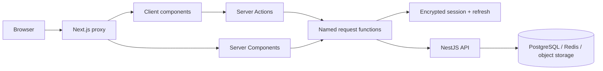

# Application System Design

## System boundary

This repository renders the authenticated product at `app.dwelve.uz`. It has no database and no
first-party REST controllers. Private data is fetched server-side from the sibling NestJS API; the
browser interacts with Server Components, Server Actions, and client components rather than the API
origin.



## Application areas

| Area           | Implementation             | Responsibility                                                                |
| -------------- | -------------------------- | ----------------------------------------------------------------------------- |
| Authentication | `src/app/(authentication)` | Login, signup, reset, encrypted sessions, token refresh                       |
| Product shell  | `src/app/(root)`           | Dashboard, school, classes, tests, notifications, profile                     |
| Studio         | `src/app/studio`           | Draft creation, import, editing, readiness, publication                       |
| Exam           | `src/app/exam`             | Test cover, attempt runtime, autosave, integrity, submission, result          |
| Invitations    | `src/app/invite`           | Targeted teacher-invite acceptance                                            |
| Onboarding     | `src/app/onboarding`       | Membershipless-account choices and first access                               |
| Route policy   | `src/proxy.ts`             | Root redirect, route protection, proactive refresh, no-index/no-store headers |

`/dev/preview/dashboard` is a development-only fixture route and returns 404 in production. The
root `/` is not a page; `src/proxy.ts` redirects it to `/dashboard` or `/login` according to session.

## Route map

| Route family                                                               | Access                                   | Purpose                                                          |
| -------------------------------------------------------------------------- | ---------------------------------------- | ---------------------------------------------------------------- |
| `/login`, `/signup`, `/signup/admin`, `/password-reset`, `/reset-password` | Public, auth-aware                       | Account access and recovery                                      |
| `/onboarding`                                                              | Authenticated                            | Choose a valid route into a school context                       |
| `/dashboard`                                                               | Authenticated                            | Role-aware overview                                              |
| `/school`, `/schools/new`                                                  | Authenticated; mutations role-gated      | School profile, membership, creation                             |
| `/groups`, `/groups/[classId]`, request/test/result descendants            | Authenticated; school-scoped             | Class discovery, roster, requests, tests, results                |
| `/tests` and result descendants                                            | Authenticated                            | Cross-class test library and grading/results                     |
| `/studio/tests/*`                                                          | Authenticated teacher/admin capabilities | Create, import, edit, and publish tests                          |
| `/exam/[testId]/*`                                                         | Authenticated eligible student           | Cover, live attempt, submission, result                          |
| `/notifications`, `/profile`                                               | Authenticated                            | Notifications, identity, role profile, sessions, support         |
| `/invite/teacher/[token]`                                                  | Public token entry, auth-aware           | Redeem a targeted teacher invitation                             |
| `/assignments/exams`, `/assignments/homework`                              | Authenticated                            | Assignment surfaces; homework is presently a limited placeholder |
| `/robots.txt`                                                              | Public                                   | Disallow crawling of the whole application                       |

See [`DOMAINS.md`](./DOMAINS.md) for cross-host redirects and indexing policy.

## Request and state flow

The standard mutation path is:

```text
client component -> TanStack mutation -> next-safe-action Server Action
-> named request function -> authedBackendJson -> NestJS API
-> Zod-validated response -> query invalidation / router refresh
```

Server-rendered reads use server-only helpers but the same named requests and Zod response schemas.
Multipart uploads use plain Server Actions because `next-safe-action` is not used to forward file
bodies.

| State                                            | Owner                                                     |
| ------------------------------------------------ | --------------------------------------------------------- |
| Identity, access/refresh tokens, selected school | Encrypted `httpOnly` session cookie                       |
| Records, permissions, membership, test lifecycle | NestJS backend                                            |
| Client server-state and invalidation             | TanStack Query                                            |
| Form drafts and field errors                     | React Hook Form + Zod                                     |
| Test-builder draft composition                   | Feature-local client state persisted through test actions |
| Theme                                            | `next-themes`                                             |
| Locale                                           | i18next and browser persistence                           |

## Backend boundary

The sibling repository is `../backend_nestJS`. Local development convention is:

```env
DWELVE_API_BASE_URL=http://localhost:5001/api/v1
```

The value is server-only. Backend source, Swagger, and backend docs are canonical for persistence and
authorization; this repository documents only the contracts its UI consumes.

## Important architectural decisions

- App and marketing are separate deployments; this host is never indexable.
- Refresh-token rotation is handled before render in the proxy whenever possible because Server
  Components cannot persist a replacement cookie.
- Backend data is untrusted until parsed with Zod.
- The backend—not the selected UI—is authoritative for role and object access.
- Exam layouts intentionally remove unrelated navigation and use dynamic rendering; a cached exam
  page could contain a stale deadline.
